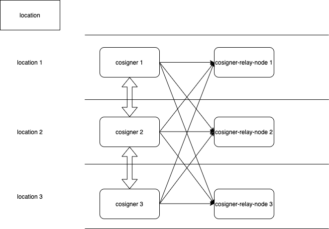
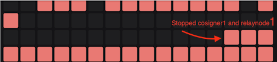

# MPC local Test with docker-compose and juno-uni-1 testnet

versions:

Juno binary
```
name: juno
server_name: junod
version: v2.0.0-alpha.3
commit: aa76b97e1f481580707b41351beb1e82449669fb
build_tags: netgo,ledger
go: go version go1.17 darwin/amd64
```


Tendermint-mpc binary commit:

```
e4a1fa93e05681e9aa4e8419795d1f268e06b049
```

## Create cosigner bin

```
git clone https://gitlab.com/unit410/tendermint-validator

cd tendermint-validator

git checkout e4a1fa93e05681e9aa4e8419795d1f268e06b049

go mod tidy

env GOOS=linux GOARCH=amd64 make build
```

copy binary to this Repository \<project-dir>/cosigners/bin

example:

`cp tendermint-validator/build/* tendermint-mpc-test/cosigners/bin`


## Create cosigner-relay-nodes bin

```
git clone https://github.com/CosmosContracts/juno

cd juno

git checkout aa76b97e1f481580707b41351beb1e82449669fb

docker build -t cosigner-relay-nodes .

docker run --name cosigner-relay-nodes -ti cosigner-relay-nodes /bin/sh

## copy binary to host system

docker cp cosigner-relay-nodes:/usr/bin/junod .

```

example:

`cp junod tendermint-mpc-test/cosigner-relay-nodes/bin`

## Build cosigner-relay-nodes image

in this project dir:

`docker build -t cosigner-relay-node:v0.0.1 cosigner-relay-nodes --no-cache`

## Run cosigner-relay-nodes image locally (optional)

`docker run --env-file envval.list cosigner-relay-node:v0.0.1`

## Create shares

`key2shares --total 3 --threshold 2 priv_validator_key.json (or other location of priv_validator_key.json)`

rename private_share_1.json to share.json and copy to <this-project-dir/cosigners/config/shares/1/share.json>
rename private_share_2.json to share.json and copy to <this-project-dir/cosigners/config/shares/2/share.json>
rename private_share_3.json to share.json and copy to <this-project-dir/cosigners/config/shares/3/share.json>

## Build cosigners image

in this project dir:

`docker build -t cosigner:v0.0.1 cosigner --no-cache`

## Run cosigners image locally (optional)

`docker run --env-file envsigner.list cosigner:v0.0.1`


## Important information

docker-compose file tries to attach your lokal ~/.juno, ~/.juno2 and ~/.juno3 (second cosigner-relay-node and third cosigner-relay-node) folder to start at synced blocked height (you should store this chaindata there)

to create ~/.juno2 with chain data. You can copy ~/.juno files to ~/.juno2 `cp -R ~/.juno ~/.juno2` (please stop your local daemon before copy)

do the same for ~/.juno3

if you want to use data in validator image for ~/.juno and ~/.juno2 set OVERWRITE=1 for both validators in docker-compose.yml. (pay attention. this overwrites data in ~/.juno and ~/.juno2 with the data in cosigner-relay-nodes/config (docker image) and starts syncing around Block 0)

### Start docker-compose

`docker-compose up`


### cmds

in this \<project-dir>

```
docker-compose logs cosigner-relay-node1 -f

docker-compose logs cosigner-relay-node2 -f

docker-compose logs cosigner-relay-node3 -f


docker-compose logs cosigner1 -f

docker-compose logs cosigner2 -f

docker-compose logs cosigner3 -f
```


## Watch status

val1:`curl localhost:30057/status`

val2:`curl localhost:30157/status`


## Check current cosigner logs for =SIGNED_MSG_TYPE_



in project dir.

`docker-compose stop cosigner1` (or other cosigner: ex. cosigner2, cosigner3)

and

`docker-compose stop cosigner-relay-node1`

in this test case I stopped cosigner1 with "=SIGNED_MSG_TYPE_" logs:

cosigner3 throws error:

`GetEphemeralSecretPart req error` and the two remaining cosigners shows some weird behavior where some blocks are signed and some not.



Expected behaviour: 100% signing

Ticket here: `https://gitlab.com/unit410/tendermint-validator/-/issues/2`

## if you need to create val

`junod tx staking create-validator --amount 1000000ujunox --node tcp://localhost:30057 --keyring-backend test --chain-id uni --fees 500ujunox --from Wallet --node-id bc1909ad9b5f1f08a5d9506ee9376d27672721de --moniker test-bl --pubkey '{"@type":"/cosmos.crypto.ed25519.PubKey","key":"\<key\>"}' --commission-max-change-rate 0.01 --commission-max-rate 0.3999 --commission-rate 0.0999 --min-self-delegation 1`